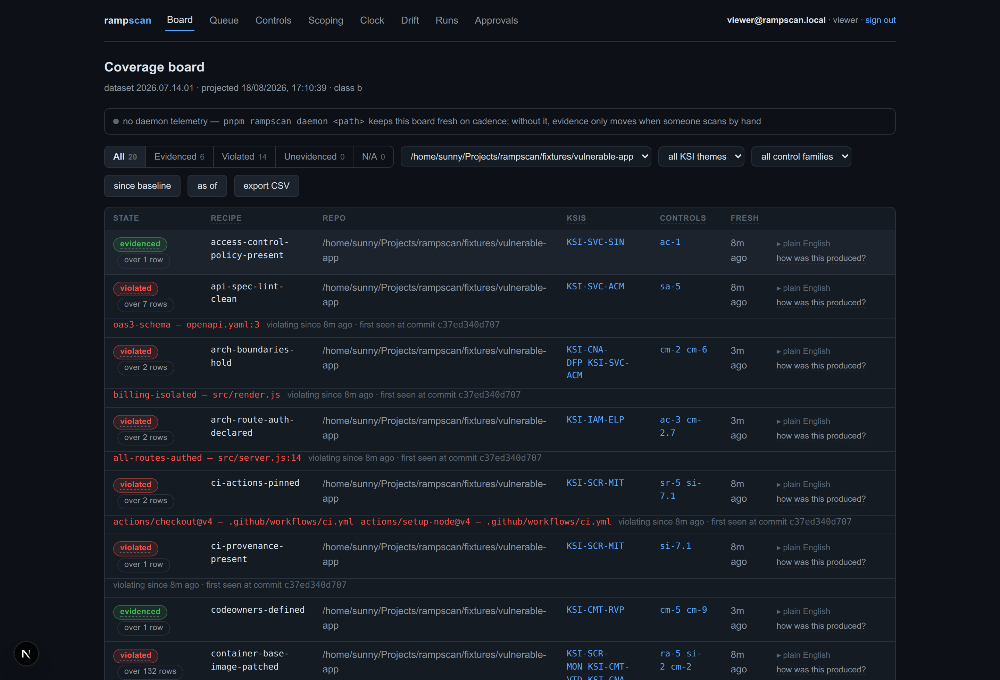
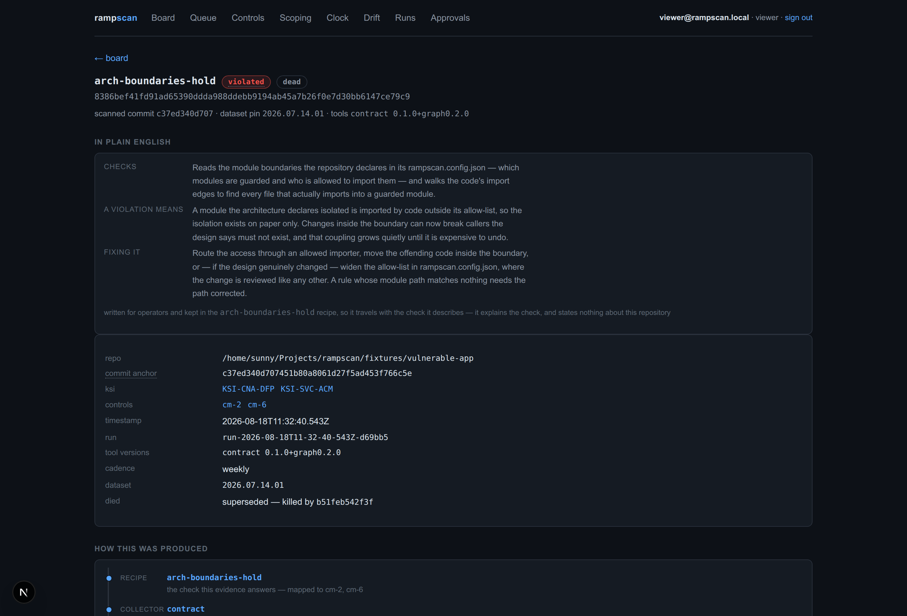
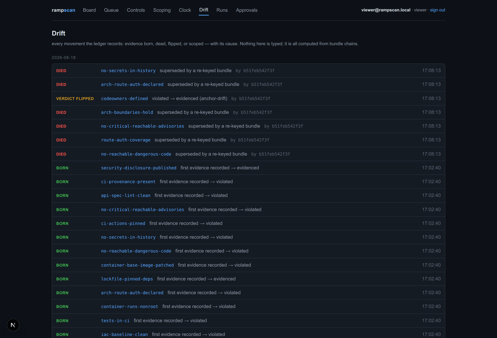

# rampscan

[](https://github.com/snymrova/rampscan/actions/workflows/test.yml)
[](https://github.com/snymrova/rampscan/actions/workflows/smoke.yml)

Pipeline-source evidence for FedRAMP 20x: a scan harness deployed **inside the client's AWS account** that fetches their repositories, scans code / IaC / CI, and produces signed, commit-anchored evidence — keyed to [ramprules](https://ramprules.com) recipe and control IDs — on the MVX re-verification clock (7 days class b, 3 days class c).

ramprules answers *what is owed* and *what AWS APIs can prove*. rampscan supplies the other half: *what the repository and pipeline can prove* — the `pipeline` evidence source that ramprules' automation frontier reserves and currently holds at zero.

Out of scope, deliberately: executing ramprules' AWS evidence recipes (the client runs those directly — they're copy-pasteable by design), and any SaaS control plane that would move code or evidence out of the client's boundary.

## Status

**`v0.1.0-beta`.** Eleven CLI commands, twenty recipes, a signed append-only ledger, a projection you can rebuild and prove, and a console. 695 tests across 59 files — 692 pass on a fresh clone and 3 skip until `pnpm run fetch-pocketbase` supplies the binary they need, after which all 695 pass. `tsc --build` is clean at the root and in the console, and both the suite and both typechecks are gated in CI on every pull request.

It is a beta because of the number in the next section, not because the machinery is unfinished.

## How much of FedRAMP this actually answers

Ground rule: **every number here comes from a command.** This one comes from `rampscan frontier`, which probes nothing and writes nothing — it counts the rows it prints.

```
$ pnpm rampscan frontier

frontier 112 uncovered controls · dataset 2026.07.14.01
  adjudicated  0 automatable · 20 partial · 24 narrative
  unreviewed   68  ← the question nobody has asked yet
  discharged   0  (automatable AND a recipe exists today)

the commit plane's ceiling
  catalog covers   23 of 209 controls a KSI reaches
  reachable        38 of 209 — 18.2%
  reachable = what the catalog claims today ∪ what the adjudication says a repository could answer
```

**23 of 209 covered, and a ceiling of 38.** Read cold that looks like an unfinished tool, so read it the other way: the second line is the honest statement of what a *repository* can never answer, and it is the more useful of the two. Most FedRAMP controls are about acts performed on or by people — training delivered, screening completed, an agreement signed — and the document a repository could hold is evidence *about* the act, not the act. A tool that claimed 209 of 209 from a checkout would be claiming it can see things that leave no trace in one.

`frontier` also names what nobody has decided yet: **68 controls unreviewed**, printed as a question rather than as a gap. The full output breaks all of it down by family and shows where this project and ramprules reasoned about the same control — including where they disagree, which is recorded rather than smoothed over.

## What it does

`rampscan scan <path>` runs the collectors over a checkout — repo-facts, gitleaks, graph, syft, osv-scanner, reachability, grype, semgrep, checkov, spectral, documents, contract — joins their output against the twenty recipes in [`recipes/commit/`](recipes/commit/), and records each evidenced/violated row as a signed, commit-anchored bundle in an append-only content-addressed ledger. Re-scans keep unchanged evidence alive under its original signature; when an anchoring file changes, the projector marks that evidence `dead(anchor-drift)` and names the killing commit.

The reachability tier is what separates a verdict from a count. The `graph` collector builds `graph.db` for the snapshot (TypeScript/JavaScript import + call graph, exact vs inferred marked per edge; entry points from package.json bins/exports, overridable via `graph.entrypoints`), and the `reachability` collector joins `osv-results.json × graph.db`: a reachable advisory is `violated` with the call path as the artifact, a provably unreachable one becomes a **signed not-affected OpenVEX** (justification `vulnerable_code_not_in_execute_path`, exported to `out/exports/openvex.json`, digest-pinned as a subject of the signed bundle). No graph, or no detectable entry points, degrades to the honest posture — every advisory counts, marked `unknown`.

`rampscan serve` is the visual loop: PocketBase as projection store and auth, a Next.js console with the coverage board (filterable by KSI theme, control family, repo), the clock view (bundle age against the MVX window, expiring first), the drift view (born / died / verdict-flipped / scoped, with cause and killing commit), and the two-key queue — any signed-in identity proposes a `notApplicable`, an approver's key turn signs a scoping event into the **ledger**, and the register flips only when the projector re-folds it. The projector is the only writer of projection collections, enforced by PocketBase rules rather than by discipline, and a ledger watcher re-projects on every append, so a scan in another terminal moves the board live.

`rampscan rebuild` drops the projection, refills it from the ledger and proves byte equality. `rampscan verify <digest>` checks any bundle or scoping event offline. `rampscan check` is the dry run over the working tree — pure gates, nothing signed, nothing appended, exit 1 on a would-be violation.

## How it is run

**From a clone, with `pnpm rampscan …`.** Every workspace package is `private: true` with no `bin` and nothing is published to npm, so `npm i -g rampscan` will not work and is not meant to — the entry point is `tsx packages/cli/src/main.ts`, wrapped by the root `rampscan` script. That is a decision rather than an omission: no external user has asked for a binary yet, and shipping one before then means versioning a surface nobody is using. The tag is the only version surface.

## Quickstart

Walked from a clone into an empty directory, with no `node_modules`, no ledger, no keys and no PocketBase binary present. Node 22 is the only prerequisite; pnpm is pinned by the `packageManager` field, so Corepack fetches the right version itself.

```
git clone https://github.com/snymrova/rampscan && cd rampscan
pnpm install            # seconds; no build scripts run — see pnpm-workspace.yaml
pnpm test               # 692 passed | 3 skipped (695) — the 3 want PocketBase, see below
pnpm run doctor         # how each scan tool resolves on THIS machine
pnpm rampscan scan .    # scan this repository with itself
pnpm rampscan board     # the projection: registers, live evidence, graveyard
```

Note `pnpm run doctor`, not `pnpm doctor` — pnpm has a built-in `doctor` command of its own that will shadow the script and cheerfully report that everything is fine about something else entirely.

**No scan tools and no Docker is a supported machine**, and it is worth seeing before you install anything, because the graceful skip is a feature rather than an apology:

```
$ pnpm run doctor
  absent   docker       no Docker — tools must be installed as binaries (https://docs.docker.com/engine/install/)
  MISSING  syft         SBOM (CycloneDX) — M1 collector
           install syft — or install Docker and nothing else is needed
  MISSING  gitleaks     secrets, full history — M1 collector
           install gitleaks — or install Docker and nothing else is needed
  ...
7 tool(s) cannot resolve. Their collectors will skip with the reason recorded,
and their recipes will read unevidenced.
```

Nothing crashes and nothing silently passes: the recipes those collectors feed report `unevidenced` with the reason attached, which is the whole posture — a control with no evidence is never a control that passed. Install Docker and the same command resolves every tool to a pinned image from [`packages/collectors/tools.json`](packages/collectors/tools.json), pulled on first use. A binary already on PATH is used as-is. **rampscan installs nothing on the host, ever.**

For the console, one extra step fetches and sha256-verifies the pinned PocketBase binary:

```
pnpm run fetch-pocketbase     # sha256 verified against console/pocketbase/version.json
pnpm rampscan serve           # PocketBase + the Next.js console on :3000
```

## The console

Three views, screenshotted from a real projection — the scans behind them are
`rampscan scan fixtures/vulnerable-app`, run twice with one fault fixed in between.

**The coverage board.** Every recipe against every repository, with the offender
pointer printed under the row that failed and `violating since … · first seen at
commit …` beside it. A verdict here is never a bare red dot: it names the file,
the rule and the commit that introduced it.



**An evidence bundle.** What a signed bundle actually contains, and the reason
the plain-English block is authored per recipe rather than generated: it explains
the *check* and says nothing about your repository, so it stays true when the
verdict changes. This one is marked `dead` because the second scan superseded it
— the ledger keeps it and names the commit that killed it.



**Drift.** Every movement the ledger records, with its cause. The `VERDICT
FLIPPED` row is the second scan finding the `CODEOWNERS` file that the first scan
reported missing — `violated → evidenced (anchor-drift)`, attributed to the
commit that did it. Nothing on this page is typed; it is folded from the bundle
chain.



## It scans itself

The clearest demonstration is the one you can reproduce in the clone you just made. `rampscan scan .` on this repository:

```
12 evidenced · 2 violated · 6 unevidenced · 2 findings
```

Both violations are real and both are left standing on purpose.

`ci-provenance-present` wants a workflow step that attests a build. This repository **publishes no artifact** — every package is private, the CLI runs from a clone — so a provenance step here would attest nothing and the recipe would pass on it. Passing a control you cannot prove is not a wrong answer, it is a false attestation, and it is the one thing [`SECURITY.md`](SECURITY.md) asks you to report as a vulnerability. It flips when there is something to attest.

`iac-baseline-clean` is checkov flagging the deliberately faulty workflow inside the generated test fixture — which raises a genuine scope question, whether a checkout scan should read paths the repository gitignores, that is open rather than answered.

## Documentation

- [`docs/ARCHITECTURE.md`](docs/ARCHITECTURE.md) — components, the scan pipeline end to end, stores, trust boundaries, evidence lifecycle, invariants.
- [`docs/SPEC.md`](docs/SPEC.md) — the working spec: tech, architecture, dataflow, primitives, UI.
- [`docs/COMPLIANCE-SCAN-HARNESS.md`](docs/COMPLIANCE-SCAN-HARNESS.md) — the founding brainstorm, including the decisions log (§11–§13).
- [`docs/FRONTIER-PIPELINE.md`](docs/FRONTIER-PIPELINE.md) — generated by `rampscan report` from the last scan.
- [`docs/context/`](docs/context/README.md) — snapshots of the ramprules dataset and the harnessarch brainstorms, for agent context. Read its README before trusting a number.
- [`CONTRIBUTING.md`](CONTRIBUTING.md) — the ten ground rules, each named with the test that enforces it.
- [`SECURITY.md`](SECURITY.md) — reporting path, and what rampscan does and does not send anywhere.

## Licence

Apache-2.0 — see [`LICENSE`](LICENSE) and [`NOTICE`](NOTICE).
