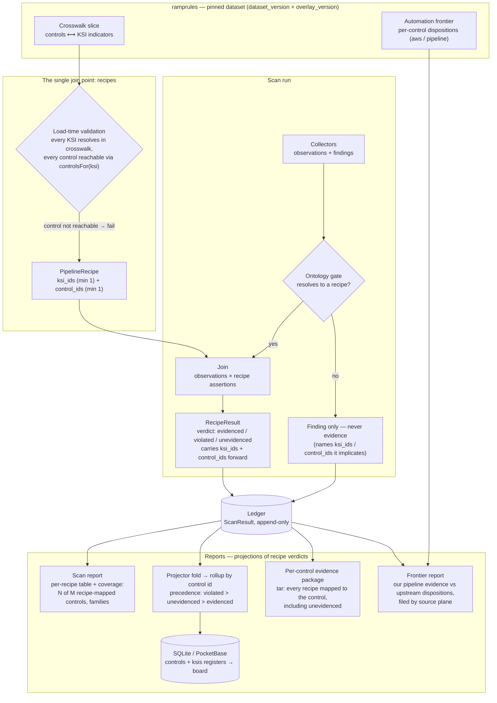

# How controls map to reports

rampscan never maps controls to reports directly — **recipes are the single join
point**. Control IDs enter the system only through the pinned ramprules
crosswalk, get bound to recipes under a reachability check, ride each recipe
verdict through the join into the ledger, and every report is a different
projection of those verdict-attached `control_ids`.

Mermaid source (renders natively on GitHub)

## Where each edge lives

- **Crosswalk slice** — `packages/dataset/src/types.ts` (`CrosswalkControl`,
  `CrosswalkIndicator`); version pins in `packages/dataset/src/pins.ts`.
- **Recipe shape** — `packages/schema/src/recipe.ts` (`ksi_ids` and
  `control_ids`, each `min(1)`).
- **Reachability validation** — `packages/cli/src/recipes.ts`: every KSI must
  resolve in the crosswalk, and every claimed control must be reachable from
  the recipe's KSIs via `dataset.controlsFor(ksi)`.
- **Join and ontology gate** — `packages/core/src/join.ts`: collector output ×
  recipe assertions → per-recipe verdict; anything that doesn't resolve to a
  recipe is a finding only, never evidence.
- **Scan report** — `packages/cli/src/report.ts`: coverage counts are over
  *recipe-mapped* controls, not the whole catalog.
- **Projector rollup** — `packages/projector/src/fold.ts` (`rollup()`):
  violated beats unevidenced beats evidenced; `notApplicable` wins only when
  every mapped recipe is scoped out.
- **Per-control evidence package** — `packages/cli/src/export.ts`: every recipe
  mapped to the control appears in the manifest, including unevidenced ones.
- **Frontier report** — `packages/cli/src/frontier.ts`: dispositions filed
  under the upstream plane (`aws` / `pipeline`) that wrote them.
