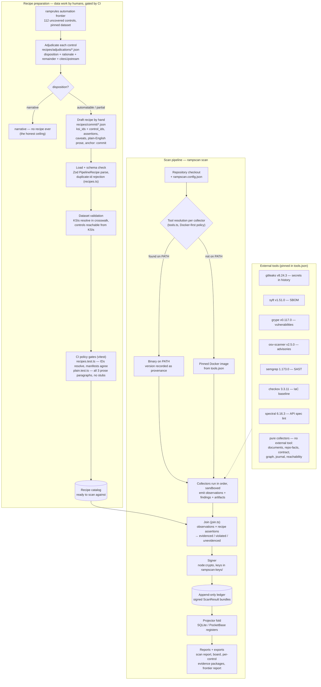

# How recipes are prepared, and the pipeline that runs them

Recipes are hand-authored JSON data artifacts — the code never generates them,
it only validates them. Preparation runs **adjudicate → draft → validate →
CI-gate**; the scan pipeline then runs the catalog against a checkout using
version-pinned external tools.

Mermaid source (renders natively on GitHub)

## The preparation flow, stage by stage

1. **Adjudicate** — `recipes/adjudications/*.json`, one file per control from
   ramprules' 112 uncovered controls (`rampscan frontier`'s count against the
   pinned dataset). Each records a disposition
   (`automatable | partial | narrative`), paragraph-length rationale, an
   explicit `remainder` (what the pipeline plane can never prove, split into
   control and boundary limbs), and `citesUpstream` (agreement or divergence
   with ramprules' AWS-plane verdict). Controls adjudicated `narrative` stop
   here — that refusal is the product's honesty, not a gap.
2. **Draft** — `recipes/commit/*.json`, mirroring ramprules'
   `aws-evidence.json` recipe shape (one rename: `govcloud` → `caveats`) so
   the overlay can be contributed upstream. Each recipe carries the
   control mapping (`ksi_ids` + `control_ids`), machine `assertions`, honest
   `caveats`/`notes`/`empty_means`, and the three-paragraph `plain` prose.
3. **Validate** — `packages/cli/src/recipes.ts`: Zod parse against
   `PipelineRecipe` (schema in `packages/schema/src/recipe.ts`), duplicate-id
   rejection, then `validateRecipeIds` — every KSI must resolve in the pinned
   crosswalk and every control must be reachable from the recipe's KSIs.
4. **CI-gate** — `packages/cli/test/recipes.test.ts` (schema-valid, IDs
   resolve, made-up controls rejected, collector manifests agree with recipes)
   and `packages/cli/test/plain.test.ts` (all three prose paragraphs present,
   real prose not stubs, no verdicts in prose, glossary coverage). The schema
   keeps `plain` optional because it mirrors upstream's shape; the tests make
   it mandatory for the shipped catalog — shape is schema's job, completeness
   is policy's.

## Tool resolution at scan time

Collectors never spawn tools ad hoc (`packages/collectors/src/tools.ts`,
Docker-first policy): a binary already on PATH is used as-is with its version
recorded as provenance; otherwise the collector runs the **pinned image** from
`packages/collectors/tools.json`. A tool on neither path makes the collector
skip with a stated reason — which surfaces as `unevidenced`, never as silence.
